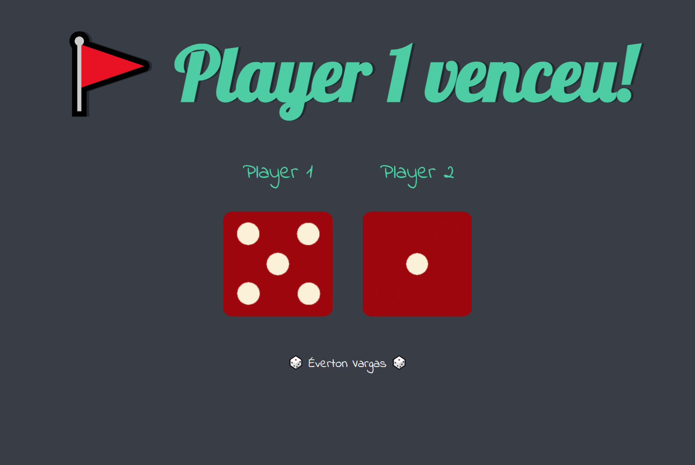
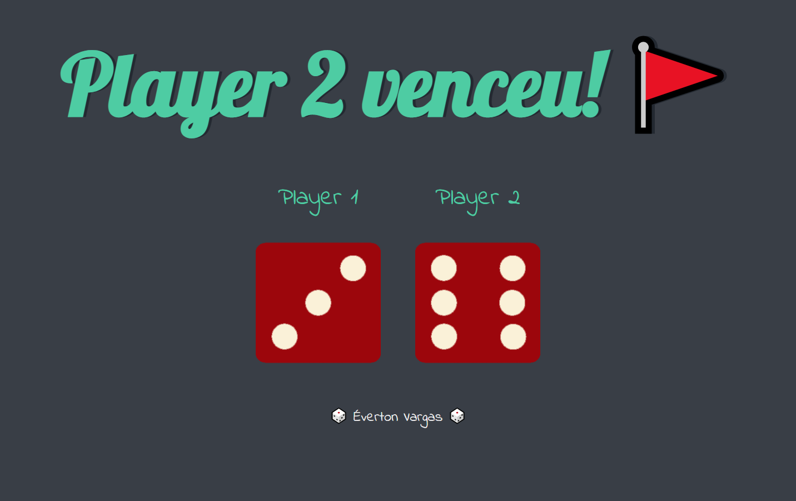
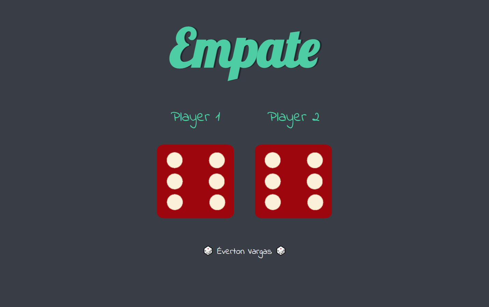

### Jogo de Dados - Aprendendo a manipular o DOM

>ao recarregar a tela apertando F5 ou dando refresh na página. Conforme os dados que aparecerem, um resultado é exibido

3 resultados são possíveis:
- Vitória player 1

    

- Vitória player 2

    

- Empate

    

